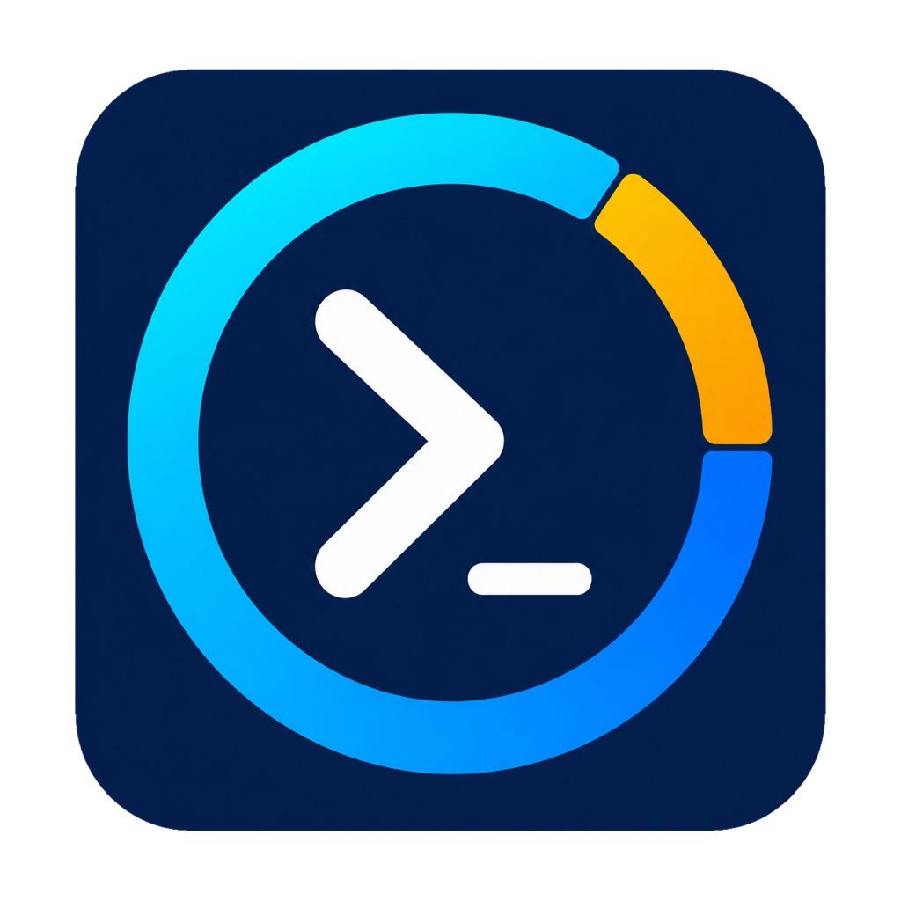

# Codex Usage Menu Bar

English | [简体中文](README.md)

A native macOS menu bar utility that shows your remaining Codex usage, reset countdown, and the number of tasks that are running or waiting for you.



[Download the latest release](https://github.com/shengyuanjie/CodexQuotaMenu/releases/latest) · [Full usage guide](docs/product-and-usage.en.md) · [Privacy notice](PRIVACY.en.md) · [Support the project](#support-the-project)

## Features

- Shows the remaining percentage, exact reset time, and countdown for Codex usage windows.
- Shows every usage window returned by Codex and the current plan type.
- Uses `▶` for the number of tasks that are running normally.
- Uses `⏸` for the number of tasks waiting for approval, a choice, manual input, an upload, or a reply.
- Lists recent running and waiting tasks in the menu and shows explicit error states.
- Refreshes every five seconds, supports an immediate manual refresh, and preserves the last successful result during temporary query failures.
- Uses a text-only menu-bar display without a leading icon for a cleaner appearance.
- Supports Follow System, Simplified Chinese, and English interface languages.
- Reuses your existing local Codex sign-in; no account token needs to be provided to this project.
- Contains no advertising, analytics, telemetry, or third-party runtime dependencies.

Completed tasks are not included in the menu bar counts, and no completed-task count is shown.

## Menu Bar Display

```text
Codex 90% · 4h 25m · ▶ 1 | ⏸ 0
```

| Display | Meaning |
|---|---|
| `Codex 90%` | Remaining percentage for the shortest usage window |
| `4h 25m` | Time until that window resets |
| `▶ 1` | Number of tasks currently running normally |
| `⏸ 0` | Number of tasks waiting for approval, a choice, input, an upload, or a reply |

Click the menu bar item to see all usage windows, plan type, recent task titles, error count, last update time, and the Refresh Now, Language, and Quit actions.

Task state detection prioritizes Codex runtime flags and pending tool calls. If a completed response still requires user action, the app also evaluates the full current response locally. Natural language is ambiguous, so a small number of false positives or missed waiting states may still occur.

## Requirements

- macOS 14 or later.
- A signed-in Codex desktop app, Codex included with the ChatGPT desktop app, or Codex CLI.
- Download the `arm64` release for Apple Silicon or the `x86_64` release for an Intel Mac.

## Install

1. Download the ZIP matching your Mac from [GitHub Releases](https://github.com/shengyuanjie/CodexQuotaMenu/releases/latest).
2. Download the matching `.sha256` file and verify the archive.
3. Extract the ZIP and move `Codex用量.app` to Applications.
4. This project does not currently have an Apple Developer certificate. The app is ad-hoc signed with Hardened Runtime enabled, but it is not notarized. On first launch, you may need to right-click the app in Finder and select **Open**.

Do not download builds from unofficial mirror sites. Public release archives are built from version tags by this repository's GitHub Actions workflow.

## How to Use

1. Launch `Codex用量.app` from Applications. It has no main window or Dock icon; look for it in the macOS menu bar.
2. Read the remaining usage, reset countdown, `▶` running count, and `⏸` waiting count directly from the menu bar.
3. Click the item for details. Choose **Refresh Now**, or press `R` while the menu is open, to query immediately.
4. Choose **Language** to switch instantly between Follow System, Simplified Chinese, and English.
5. Choose **Quit**, or press `Q` while the menu is open, to stop the app and its local status queries.

To start the app at login, open **System Settings → General → Login Items**, click **+**, and select `Codex用量.app` from Applications.

The app keeps a local Codex connection and queries every five seconds. “Real time” here means frequent automatic refreshes rather than a server push; changes normally appear after the next refresh.

## Privacy

The app queries usage and task metadata through a local Codex process. To identify running, waiting, and completed tasks, it may read up to the last 512 KB of relevant local Codex session logs. This may include task titles and the current turn's response.

All such content is processed in memory. It is not copied, stored in a project database, uploaded, or used for telemetry. The only setting persisted by this app is the selected interface language.

See the [English privacy notice](PRIVACY.en.md) for the complete statement.

## Security Boundaries

- App Sandbox is not enabled because the app must start a local Codex subprocess and read Codex session logs.
- Release builds use Hardened Runtime and ad-hoc signing, but are not trusted by Gatekeeper like a notarized Developer ID build.
- Codex itself may connect to OpenAI as part of its normal operation; this utility does not implement its own upload service.
- See the [English security policy](SECURITY.en.md) for responsible vulnerability reporting.

## Troubleshooting

- **No window appears:** This is a menu bar app. Check the top of the screen; it has no normal window or Dock icon.
- **The menu stays on “Loading…” or `Codex --`:** Confirm that Codex or the ChatGPT desktop app is installed and signed in, then choose **Refresh Now** or restart this utility.
- **`▶ 1` remains when no task is running:** Refresh first. An abnormally interrupted task that receives no further updates stops counting as running after 30 minutes.
- **The `⏸` count looks wrong:** Refresh after completing the approval, choice, or reply. Local natural-language detection can occasionally produce a false positive or miss a waiting state.
- **macOS cannot verify the developer:** Confirm that the archive came from this project's Release page and passed SHA-256 verification, then right-click the app in Finder and choose **Open**.

See the [full product and usage guide](docs/product-and-usage.en.md) for additional troubleshooting and uninstall instructions.

## Build from Source

Install Xcode Command Line Tools, then run:

```sh
./build-app.sh
```

The script creates a release build for the current Mac architecture, strips debug symbols and build-machine user paths, includes the app icon, enables Hardened Runtime, applies an ad-hoc signature, and verifies the bundle signature.

If Codex is installed in a nonstandard location, advanced users may set `CODEX_CLI_PATH` in the app's launch environment.

## Support the Project

If this project is useful to you, you can optionally support its ongoing maintenance through:

- [Afdian](https://afdian.com/a/520_00)
- [Ko-fi](https://ko-fi.com/520_00)

Donations do not affect downloads, features, updates, or issue reporting. These links appear only in the project documentation and GitHub Sponsor button; the app itself does not load or connect to either platform.

## License

Source code is released under the [MIT License](LICENSE). This independent community project is not affiliated with or endorsed by OpenAI, and its icon does not use official OpenAI or Codex trademarks.
