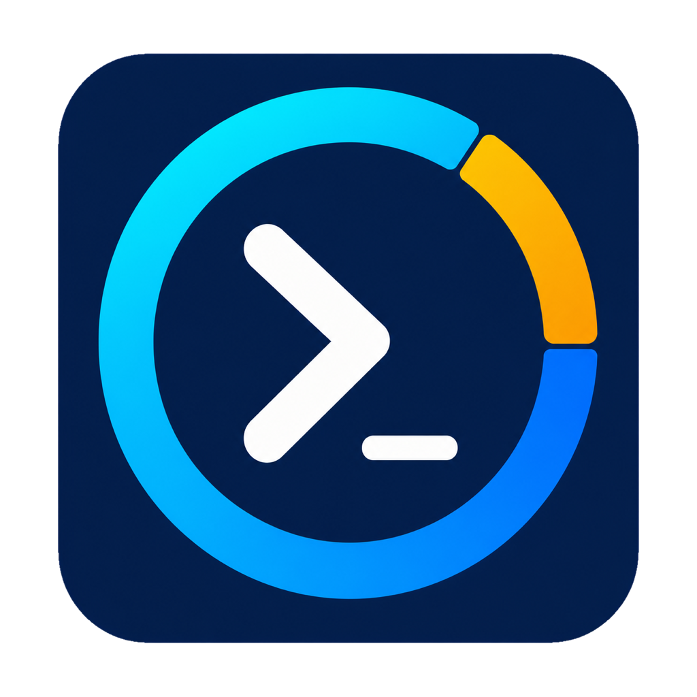

# Codex Usage Menu Bar

English | [简体中文](README.md)

A native macOS menu bar utility that shows remaining Codex usage, reset countdowns, global bonus-reset probability, and active tasks, with an optional read-only Scriptable lock-screen widget feed.



[Download the latest release](https://github.com/shengyuanjie/CodexQuotaMenu/releases/latest) · [Full usage guide](docs/product-and-usage.en.md) · [Privacy notice](PRIVACY.en.md) · [Support the project](#support-the-project)

## Features

- Choose the default model and reasoning effort for new chats in **Default Model…**, with a live model catalog, managed-override checks, and read-back verification.
- Shows the remaining percentage, exact reset time, and countdown for Codex usage windows.
- Shows every usage window returned by Codex and the current plan type.
- Uses `▶` for the number of tasks that are still active.
- Shows the single next-48-hour global bonus-reset probability from the independent community source `willcodexreset.com` in the menu.
- Lists recent active tasks in the menu and shows explicit error states.
- Refreshes every five seconds, supports an immediate manual refresh, and preserves the last successful result during temporary query failures.
- Refreshes the public forecast independently every five minutes, reads only a 64 KiB response prefix without retaining `events`, and hides cached forecast data after two hours.
- Shows an encouragement message on the first crossing to 50% or higher, then restores normal quota details on both devices after detecting that both quota windows entered their next reset cycle.
- Provides an optional, default-off, token-protected local feed for an iPhone Scriptable lock-screen widget.
- Uses a text-only menu-bar display without a leading icon for a cleaner appearance.
- Supports Follow System, Simplified Chinese, and English interface languages.
- Can apply daily activation times directly as user-level LaunchAgents without copying, pasting, or send confirmation; schedules are managed only in CodexQuotaMenu's Activation Times settings.
- Reuses your existing local Codex sign-in; no account token needs to be provided to this project.
- Contains no advertising, analytics, telemetry, or third-party runtime dependencies.

Completed tasks are not included in the menu bar counts, and no completed-task count is shown.

## Menu Bar Display

```text
Codex  5h90% left4h  W62% left2d  ▶1
```

| Display | Meaning |
|---|---|
| `5h90% left4h` | Remaining percentage and reset countdown for the five-hour window |
| `W62% left2d` | Remaining percentage and reset countdown for the weekly window |
| `▶1` | Number of tasks that are still active |

The title never shows a forecast percentage: at 50% or higher while encouragement is active it becomes `Codex  5h81% left3h  W62% Go go go  ▶1`, keeping short-window usage and its countdown while replacing the weekly countdown with “Go go go”; otherwise it shows quota details. Open the menu for the `↻48h 82%` forecast, its source, recent task titles, errors, and update times. The **Phone Widget** submenu controls the read-only local feed and copies its address or access token.

Global bonus-reset probabilities are public community forecasts from `willcodexreset.com`. They express uncertainty and are neither an official schedule nor a guarantee. The displayed forecast timestamp is source field `data.updatedAt`, while local fetch time separately determines freshness.

The app no longer classifies tasks as waiting for user action and does not analyze response text to infer intent. Any task still marked active by Codex is counted under `▶`; a detected completion marker removes it from the count.

## Requirements

- macOS 14 or later.
- A signed-in Codex desktop app, Codex included with the ChatGPT desktop app, or Codex CLI.
- Download the `arm64` release for Apple Silicon or the `x86_64` release for an Intel Mac.

## Install

1. Download the ZIP matching your Mac from [GitHub Releases](https://github.com/shengyuanjie/CodexQuotaMenu/releases/latest).
2. Download the matching `.sha256` file and verify the archive.
3. Extract the ZIP and move `Codex用量.app` to Applications.
4. This project does not currently have an Apple Developer certificate. The app is ad-hoc signed with Hardened Runtime enabled, but it is not notarized. On first launch, you may need to right-click the app in Finder and select **Open**.

Do not download builds from unofficial mirror sites. Public release archives are built from version tags by this repository's GitHub Actions workflow.

## How to Use

1. Launch `Codex用量.app` from Applications. It has no main window or Dock icon; look for it in the macOS menu bar.
2. Read the remaining usage, reset countdown, and `▶` active-task count directly from the menu bar.
3. Click the item for details. Choose **Refresh Now**, or press `R` while the menu is open, to query immediately.
4. Choose **Language** to switch instantly between Follow System, Simplified Chinese, and English.
5. For daily activation, open **Activation Times…**, add the times you need, then choose **Apply to Codex**. The app creates or updates matching user-level LaunchAgents that invoke the official `codex exec --ephemeral` CLI; these schedules appear only in CodexQuotaMenu and do not create entries in Codex's scheduled-task list or recent-task conversations. **Retry Check** appears only if actual state cannot be read. The list is empty on first launch; quitting CodexQuotaMenu does not affect created LaunchAgents.
6. For an iPhone lock-screen display, follow the [Scriptable setup guide](mobile/README.md) and enable the **Phone Widget** read-only feed. Existing Scriptable users must manually replace their imported `CodexQuotaWidget.js` with this version.
7. Choose **Quit**, or press `Q` while the menu is open, to stop all queries and the phone feed.

Managed LaunchAgent labels and filenames exactly match `com.local.codexquotamenu.activation.HHMM` under `~/Library/LaunchAgents/`. Prefix-sharing files are not owned and remain untouched. With an empty time list, **Apply to Codex** removes only the app's own LaunchAgents. Local status checks are read-only; managed scheduling changes only when the user chooses **Apply to Codex**. The app's headless runner keeps activation silent. The latest summary per time and a separate diagnostic record for each run is stored in `~/Library/Logs/CodexQuotaMenu/Activation/`, containing timestamps, exit codes, error categories, usage percentages and before/after window deadlines only. Raw command output is captured in a restricted temporary directory and removed afterwards. Each run resolves the CLI again and checks structured turn completion, stable deadlines across two queries and nonzero quota usage. Unverified or transient failures are retried once after 15 seconds; authentication and quota errors are not retried immediately. If the existing window expires within ten minutes, the runner waits until five seconds after expiry; otherwise it records that the existing window remains active. **Synced** means only that configuration and loaded state agree. After sleep, macOS may coalesce a missed calendar trigger into one catch-up run.

To start the app at login, open **System Settings → General → Login Items**, click **+**, and select `Codex用量.app` from Applications.

The app queries local usage and tasks every five seconds and refreshes public forecasts independently every five minutes. These are polling intervals, not server pushes. Scriptable suggests the earliest next refresh after five minutes, but iOS does not guarantee that schedule.

### Codex default model

Choose **Default Model…** in the menu bar to load the local Codex model catalog and supported reasoning efforts. **Save and Verify** updates user settings through `config/batchWrite`, then checks defaults using a fresh backend without generating a model response.

When `/etc/codex/requirements.toml` overrides user defaults through `[models.new_thread]`, macOS may request administrator authentication. Only the model fields and any existing speed override are edited; other settings are preserved and a unique, mode-600 backup is saved alongside the file. The app never receives or stores the password. Unrecognized policy sources, active profiles, and unsupported TOML layouts are refused. A failed save may be partial; refresh to inspect actual values.

The “Enable 1.5× speed (Fast)” checkbox saves `service_tier = "fast"` when enabled and `"default"` when disabled, updates an existing managed speed override, and verifies the result. Models without Fast support disable the checkbox. Actual speed depends on the model and service conditions and may consume more usage.

These defaults affect future local Codex chats and the next daily activation; existing chats retain their settings. Each activation reads the effective default model, reasoning effort, and speed tier at execution time, including managed overrides. Unreadable or unavailable defaults produce `default_model_unavailable` without falling back to a fixed model. Update older schedules using “Apply to Codex” in activation settings; the previous headless runner arguments remain accepted and use current defaults at runtime. After saving and verification succeed, a dialog offers “Restart Codex Now” or “Restart Manually Later”. Immediate restart requests a normal quit and relaunches after Codex exits; running tasks may be interrupted. A refused or timed-out quit is reported without force-quitting, and saved settings remain intact. Use `--check-default-model` for a read-only backend check or `--model-settings` to open the window on launch.

### Scheduled message to an existing chat

Choose **Scheduled Message…** to select a recent chat (or paste its ID or `codex://threads/<ID>` link), a model, a local date and time within the next year, and a message. The time initially shows the current time when the window opens; adjust it to the future delivery time. **Schedule** verifies the target chat and creates a separate user-level macOS LaunchAgent for one delivery. It does not create a Codex automation or change the global default model or activation times. The same window shows pending, sending, sent, and failed messages and lets you remove a record unless delivery is in progress.

Use **Add files…** to select multiple files or photos, and **Remove attachment** to remove the selected entry. Attachment-only messages use “Please review the attachments.” Up to 20 attachments are allowed, with a 25 MB per-file and 100 MB total limit; folders and symbolic links are rejected. **Schedule** saves private copies in this message's own directory, so moving or deleting originals does not affect delivery. Photos use native image input; HEIC, TIFF and other supported ImageIO formats are converted to JPEG copies. Other files are referenced by local path for the target chat to read, subject to that chat's filesystem permissions. Copies are checked for integrity before delivery; missing or changed attachments fail the whole message. Copies remain with the record and are deleted when that record is removed.

Message records are stored with mode-600 permissions in `~/Library/Application Support/CodexQuotaMenu/ScheduledMessages/`; LaunchAgent plists contain only a message ID. Both scheduling and delivery first check for an existing desktop owner. Owned chats do not require direct project-directory checks by this app; only CLI delivery checks directory read/traverse permissions, with distinct permission-denied and missing-directory errors. Metadata and model queries start in the user home directory. At the scheduled time, the app takes a process lock and atomically records the delivery attempt before delivery. Chats owned by the desktop app are sent through their existing desktop session; a running chat is allowed to become idle, with a one-hour limit for delivery and completion verification. Only chats without a desktop owner use `codex exec resume --model`. Chat picker entries bind directly to chat IDs, including when titles repeat. Select a saved entry to inspect its target ID and failure category. Failures retain only a fixed category or exit code, never raw output. Choose a supported reasoning effort for each message. Delivery uses that saved choice; if it is no longer supported, the attempt fails without silently changing it. Older records without a saved effort retain the previous chat-effort or model-default behavior. The desktop path records **sent** only after matching the target chat and verifying completion of the accepted turn ID; the CLI path requires a successful exit, matching chat ID, and `turn.completed`. Desktop status snapshots are processed only in memory, with a 128 MB receive limit for long chats containing tool history; snapshots are not saved. Desktop communication depends on the installed Codex session interface; incompatible interfaces or broken connections fail without switching paths and risking duplicate delivery. An interrupted or uncertain attempt is never automatically retried, so check the target chat before scheduling another message. The LaunchAgent is unloaded after completion or failure. A missed trigger may run after wake or login within 24 hours; later triggers are marked failed. Changes to the Mac's time zone can affect the trigger time.

## Privacy

The app queries usage and task metadata through a local Codex process. To identify whether a task is still active or completed, it may parse structured lifecycle events from up to the last 512 KB of relevant local Codex session logs. It no longer analyzes response text to infer user intent.

For daily activation, the app normally reads and validates only exact-owned LaunchAgent plists under `~/Library/LaunchAgents/` and checks their per-user `launchctl` loaded state. During first migration, it locally reads `~/.codex/automations/*/automation.toml` to identify and safely migrate entries with the exact complete name `CodexQuotaMenu · HH:mm`; it does not read their run conversations or modify any other automation. It stages and validates the new target set before replacement and attempts to restore this run's changes on failure. A local check can confirm matching plist and loaded state, but cannot prove that an individual background run succeeded. Legacy Codex automations must be paused in Codex itself. The app checks their local status and preserves their files; it does not infer scheduler cancellation from file removal.

All session content is processed in memory. It is not copied, stored in a project database, uploaded, or used for telemetry.

Forecasting performs GET requests only to `https://willcodexreset.com/api/reset-radar`, an independent community source with no OpenAI affiliation or endorsement. It reads at most 64 KiB and retains only the response code, `data.probability48h`, and `data.updatedAt`, never `events`; no personal usage, task, identity, or Codex credential is sent. `UserDefaults` stores the v3 public forecast summary, phone-feed toggle, and each activation entry's hour, minute, enabled state, and stable local ID, while the phone access token is stored in macOS Keychain. The default-off phone response contains aggregate values only: `probability48h`, `updatedAt`, `isCached`, `source`, and an optional omitted `calibrationState` forecast field.

See the [English privacy notice](PRIVACY.en.md) for the complete statement.

## Security Boundaries

- App Sandbox is not enabled because the app must start a local Codex subprocess and read Codex session logs.
- Release builds use Hardened Runtime and ad-hoc signing, but are not trusted by Gatekeeper like a notarized Developer ID build.
- Codex itself may connect to OpenAI normally. This utility additionally contacts only the documented `willcodexreset.com` public forecast endpoint and sends it no personal data.
- Plain HTTP for the phone feed is intended only for a trusted LAN or an existing encrypted VPN/home tunnel. Never port-forward it to the public internet.
- See the [English security policy](SECURITY.en.md) for responsible vulnerability reporting.

## Troubleshooting

- **No window appears:** This is a menu bar app. Check the top of the screen; it has no normal window or Dock icon.
- **The menu stays on “Loading…” or `Codex --`:** Confirm that Codex or the ChatGPT desktop app is installed and signed in, then choose **Refresh Now** or restart this utility.
- **`▶ 1` remains when no task is running:** Refresh first. An abnormally interrupted task that receives no further updates stops counting as running after 30 minutes.
- **macOS cannot verify the developer:** Confirm that the archive came from this project's Release page and passed SHA-256 verification, then right-click the app in Finder and choose **Open**.

See the [full product and usage guide](docs/product-and-usage.en.md) for additional troubleshooting and uninstall instructions.

If the app is still installed, remove every time in **Activation Times…**, choose **Apply to Codex**, and confirm **Not Configured** before deleting the app. If the app has already been deleted, unload and remove only LaunchAgents whose filename and plist `Label` both exactly match `com.local.codexquotamenu.activation.HHMM` (`HH` is `00`–`23`; `MM` is `00`–`59`). Never use a prefix wildcard to delete LaunchAgents; the linked guide provides per-item inspection and commands.

## Build from Source

Install Xcode Command Line Tools, then run:

```sh
./build-app.sh
```

The script creates a release build for the current Mac architecture, strips debug symbols and build-machine user paths, includes the app icon, enables Hardened Runtime, applies an ad-hoc signature, and verifies the bundle signature.

If Codex is installed in a nonstandard location, advanced users may set `CODEX_CLI_PATH` in the app's launch environment.

## Support the Project

If this project is useful to you, you can optionally support its ongoing maintenance through:

- [Afdian](https://afdian.com/a/520_00)
- [Ko-fi](https://ko-fi.com/520_00)

Donations do not affect downloads, features, updates, or issue reporting. These links appear only in the project documentation and GitHub Sponsor button; the app itself does not load or connect to either platform.

## License

Source code is released under the [MIT License](LICENSE). This independent community project is not affiliated with or endorsed by OpenAI, and its icon does not use official OpenAI or Codex trademarks.
