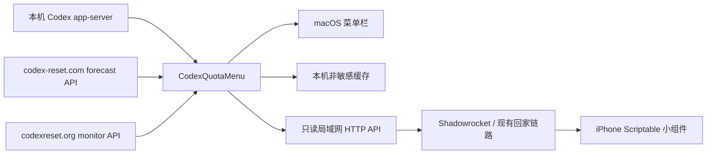

# Codex 全局重置预测与手机余量小组件设计

日期：2026-08-13
状态：已获用户口头确认，待书面复核

## 1. 背景

CodexQuotaMenu 目前通过本机 `codex app-server` 显示个人用量、计划内重置倒计时和正在运行的 Codex 任务。用户希望增加另一类信息：根据 Tibo（@thsottiaux）公开信息及历史全局重置记录，显示下一次 Codex 全局用量重置的概率。

同一份数据还需要提供给 iPhone 上的 Scriptable 锁屏余量小组件。手机已经能够通过 Shadowrocket 路由访问 Mac 所在局域网，因此由 Mac 汇总数据、手机只读取一个受保护的只读接口。

这里必须区分：

- **个人计划内重置**：Codex 账户返回的确定时间。
- **全局赠送重置**：Tibo 偶尔触发的额外重置，只能预测，不能承诺。

## 2. 目标与非目标

### 目标

1. 在 Mac 菜单栏紧凑显示未来 24 小时的全局重置概率。
2. 在下拉菜单显示 24/48 小时概率、置信度、信号状态和数据鲜度。
3. 在 Tibo 出现强提示而主概率源尚未确认时，尽快给出独立的强信号标记。
4. 由 Mac 提供一个只读、令牌保护的局域网接口，统一输出个人余量与全局重置预测。
5. 提供可直接导入 Scriptable 的锁屏小组件脚本。
6. 网络或第三方站点故障时不影响现有个人余量与任务显示。

### 非目标

- 不直接抓取 X/Twitter，不保存用户的 X 凭据。
- 不自行训练预测模型，也不把多个站点的百分比平均成新的概率。
- 不保证 iOS 按精确间隔后台刷新；刷新频率由系统调度。
- 本阶段不增加推送通知、邮件提醒或公网端口映射。
- 未经用户再次确认，不发布 GitHub Release。

## 3. 数据源评估与决策

评估口径包含：历史校准、实时响应、数据语义、接口稳定性和可降级性。2026-08-13 的快照只用于决策，运行时不能写死这些数值。

### 3.1 主概率源：codex-reset.com

接口：`https://codex-reset.com/api/forecast`

选择理由：

- 同时返回 24 小时和 48 小时概率、置信度、最近重置时间、证据及更新时间。
- 提供公开回测：当时为 279 个样本，Brier 0.100，略优于朴素基线 0.103。
- JSON 数据契约清晰，适合解析、缓存和测试。

限制：

- 相对基线的改进很小，不能把概率描述为“准确预告”。
- 本次 Tibo 明确信号出现后，主源识别最近重置曾有数十分钟延迟。

结论：它提供唯一的主数字，但 UI 必须标注为预测，并显示置信度与鲜度。

### 3.2 快速信号源：codexreset.org

接口：`https://codexreset.org/api/monitor-summary`

选择理由：

- 当前事件中对 Tibo 明确推文的反应明显快于主概率源。
- 紧凑接口可以低成本获得 48 小时强信号分数。

限制：

- 当时公开表现仅为 8 次合格事件命中 4 次，并有 1 个误报阶段，状态仍是 `experimental`。
- 摘要接口只有 48 小时分数，不包含推文时间、源更新时间或置信度。
- 全局重置完成后可能暂时继续保持 99%，不等同于“下一次重置仍有 99%”。

结论：只用于 `⚡` 预警，不提供或改写主概率。

### 3.3 不采用的数值源

- LunarWerx：回测字段丰富，但当时 155 天 Brier 为 0.1637，差于平坦基线 0.160，预测技能值为负；可用于人工核对，不进入产品数值。
- Codex Reset Radar：方法透明，但没有公开概率校准结果，并且当时来源处于 stale/fallback。
- CodexRadar：适合阅读历史时段与推文分类，不提供足够的机器可用概率校准。

不同站点的评分窗口并不完全相同，所以不直接比较 Brier 绝对值；主要依据是它们是否在各自口径下优于自己的基线，以及接口能否稳定表达其语义。

## 4. 总体架构



现有 `codex app-server` 会话仍以 5 秒节奏刷新个人用量与任务。外部预测独立刷新，不能阻塞或拖慢本机数据通路。

建议新增以下逻辑组件：

- `ForecastClient`：分别请求并解析主概率源和快速信号源。
- `ForecastCoordinator`：控制刷新、缓存、鲜度和双源协调。
- `ForecastSnapshot`：供菜单栏和手机接口共同消费的稳定内部模型。
- `WidgetServer`：基于 Network.framework 的小型只读 HTTP 服务。
- `WidgetPayloadBuilder`：把个人余量、任务数量和预测转换成版本化 JSON。

## 5. 双源协调规则

### 5.1 主概率

- 菜单栏主数字固定使用主源的 `rounded_24h`。
- 下拉菜单额外显示 `rounded_48h`、`confidence` 和 `updated_at`。
- 所有百分比限制在 0–100；缺字段、类型错误或越界时整份响应视为无效。

### 5.2 快速信号

快速信号满足以下全部条件时显示：

1. 快速源 `calibrationState == "experimental"` 或未来出现的已知可接受状态；未知状态只记录，不触发。
2. `score48h >= 90`。
3. 主源没有确认最近 6 小时内已经发生全局重置。
4. 快速源请求为本次成功结果；不复用上次缓存的强信号。

展示语义为：`⚡ Tibo 强信号，可能即将重置或正在落地`。

该信号不会把 24 小时概率改成 90%/99%，也不会与主概率平均。主源确认新的 `last_reset_at` 后立即压掉 `⚡`，避免把已经发生的事件误认为下一次预测。

### 5.3 状态优先级

从高到低：

1. `recentlyReset`：主源确认 6 小时内发生重置。
2. `strongSignal`：满足快速信号规则。
3. `forecast`：主概率可用且新鲜。
4. `cached`：主概率来自两小时内的缓存。
5. `unavailable`：没有可信主概率。

`recentlyReset` 只影响信号文案，不隐藏主源对下一次重置给出的 24/48 小时概率。

## 6. 刷新、缓存与错误处理

### 刷新节奏

- 本机个人用量与任务：保持现有 5 秒刷新。
- 两个外部预测源：每 5 分钟刷新一次。
- 用户点击“刷新”：立即刷新本机数据；若距离上次外部请求超过 30 秒，也刷新外部预测。
- 外部请求超时：10 秒。

### 缓存

- 主概率成功后持久化最后一份通过校验的响应。
- 响应时间不超过 15 分钟：正常。
- 超过 15 分钟但不超过 2 小时：显示上次值并标记“缓存/数据延迟”。
- 超过 2 小时：不再显示旧百分比，状态变为 `unavailable`。
- 快速强信号不持久化、不离线复用。

### 故障隔离

- 主概率失败：个人余量、计划内倒计时和任务继续正常刷新。
- 快速源失败：只取消 `⚡`，不影响主概率。
- 本机 `codex app-server` 失败：保留既有行为；若预测仍可用，菜单详情可继续显示预测，但不能把它伪装成个人余量已刷新。
- 手机接口始终返回独立的 `quotaStatus` 与 `forecastStatus`，避免一个子系统失败导致整份响应无法解析。

## 7. Mac 菜单栏体验

### 菜单栏标题

正常示例：

`Codex 82% · 6天23时 · ↻30% · ▶ 1`

规则：

- 现有余量、个人倒计时和运行任务位置保持不变。
- `↻30%` 表示未来 24 小时全局额外重置概率。
- 强信号时显示 `↻30% ⚡`。
- 无可信概率时显示 `↻--`，不沿用超过两小时的旧数值。
- 英文环境使用同一符号和英文详情文案。

### 下拉菜单

在个人用量区之后、任务区之前增加：

```text
全局额外重置预测
未来 24 小时：30%
未来 48 小时：50%
置信度：中
状态：最近已重置 / Tibo 强信号 / 常规预测 / 数据延迟
预测更新：10:43
```

如有强信号，再增加醒目的只读行：

`⚡ Tibo 强信号，可能即将重置或正在落地`

预测区必须使用“全局额外重置”措辞，避免与个人计划内倒计时混淆。

## 8. 手机只读接口

### 服务范围

- 基于 `NWListener`，固定端口建议为 `47821`。
- 默认关闭；用户在菜单中的“手机小组件”子菜单启用。
- 只允许 `GET /v1/widget`，其余路径或方法拒绝。
- 不提供控制、刷新、执行任务或读取对话内容的接口。
- 不做公网端口映射；仅供局域网或用户已有的加密回家链路访问。

### 鉴权

- 首次启用时生成至少 32 字节随机令牌。
- Mac 端存入 Keychain；Scriptable 端存入 Scriptable Keychain。
- 请求使用 `Authorization: Bearer <token>`，不把令牌放在 URL 中。
- 菜单提供“复制小组件地址”“复制访问令牌”“重新生成令牌”。重新生成会立即让旧令牌失效。
- HTTP 响应禁止输出 Codex 登录令牌、任务标题、文件路径或对话内容。

### 版本化响应

示例：

```json
{
  "schemaVersion": 1,
  "generatedAt": "2026-08-13T02:43:49Z",
  "quotaStatus": "fresh",
  "quota": {
    "weeklyRemainingPercent": 82,
    "weeklyResetsAt": "2026-08-19T08:00:00Z",
    "shortRemainingPercent": 64,
    "shortResetsAt": "2026-08-13T07:00:00Z"
  },
  "tasks": {
    "runningCount": 1
  },
  "forecastStatus": "recentlyReset",
  "forecast": {
    "probability24h": 30,
    "probability48h": 50,
    "confidence": "medium",
    "strongSignal": false,
    "lastResetAt": "2026-08-13T01:01:37Z",
    "updatedAt": "2026-08-13T02:43:49Z",
    "isCached": false,
    "source": "codex-reset.com"
  }
}
```

可选字段缺失时使用 `null` 或省略，但 `schemaVersion`、两个状态字段和 `generatedAt` 必须存在。错误响应不包含内部错误栈。

## 9. Scriptable 小组件

### 配置

脚本首次运行时由用户填写：

- Mac 的局域网地址，例如 `http://192.168.x.x:47821`。
- 从 Mac 菜单复制的访问令牌。

地址和令牌保存到 Scriptable Keychain。由于经 Shadowrocket 访问局域网时 `.local` 名称不一定能解析，优先使用固定局域网 IP 或 DHCP 保留地址。

### 展示

锁屏横向小组件的主要层级：

```text
Codex 周余量 82%
6天23时后恢复 · ↻24h 30%
```

状态变化：

- 强信号：第二行改为黄色 `⚡ Tibo 重置信号 · ↻24h 30%`。
- 缓存：显示 `预测缓存` 和最后更新时间。
- Mac 离线：使用 Scriptable 本地最后成功响应；超过两小时后显示 `Mac 离线 · 数据已过期`，不继续展示旧预测百分比。
- 个人余量与预测分别降级；某一项为空时另一项仍可显示。

Scriptable 小组件刷新时间只作为系统建议，不能承诺精确五分钟。脚本在前台运行时提供完整预览和连接错误说明。

## 10. 安全与隐私

- 第三方预测请求不包含用户身份、个人余量或 Codex 凭据。
- 手机 API 仅包含汇总数值，不包含任务标题和对话数据。
- API 默认关闭，启用后仍需随机令牌。
- 对请求头和请求体设置严格长度上限；单连接读取超时后关闭。
- 比较令牌时使用定时安全比较，减少不必要的侧信道。
- 日志只记录状态码、时间和错误类别，不记录 Authorization 头。
- 由于本地接口是 HTTP，禁止直接暴露到公网；现有 Shadowrocket/回家链路负责远程传输保护。

## 11. 测试设计

### 单元测试

1. 主概率 JSON：完整响应、可选字段、非法类型、越界概率、无效日期。
2. 快速源 JSON：阈值上下、未知校准状态、缺字段。
3. 协调规则：最近重置压制 99%、超过 6 小时触发强信号、强信号不缓存。
4. 鲜度：15 分钟、2 小时边界和时钟偏差。
5. 菜单标题：正常、强信号、缓存、不可用、中英文。
6. 手机 payload：周窗口识别、空值、schema 版本和 ISO 8601 日期。
7. 鉴权：正确令牌、错误令牌、缺失令牌、令牌轮换。
8. HTTP 路由：成功、401、404、405、超长请求和畸形请求。

测试使用固定时钟和 URL 加载桩，不访问真实第三方网络。

### 本机验证

- `swift test`
- Debug 与 Release 构建。
- 现有 `--check` 本机 Codex 连接检查继续通过；外部预测失败不应令它失败。
- 启动应用，目视验证菜单栏标题、下拉分区、中文/英文切换和手动刷新。
- 使用 `curl` 验证手机接口：无令牌为 401，正确令牌返回 schema v1。
- 断网或拦截单个数据源，验证独立降级和两小时过期规则。

### 手机验证

- Scriptable 前台预览小组件。
- 同一局域网访问一次，再通过现有 Shadowrocket 回家链路访问一次。
- 锁屏实际添加组件，检查截断、颜色、中文字体和过期状态。
- iOS 后台刷新只能记录实测结果，不能宣称固定周期。

## 12. 交付与发布边界

实施完成后的交付包括：

- CodexQuotaMenu 源码和测试。
- `mobile/CodexQuotaWidget.js` Scriptable 脚本。
- 手机配置与局域网安全说明。
- 本机测试、构建、接口和 UI 验证结果。

先在用户本机安装并验证实际效果。只有用户明确说“确认效果无误，你可以发布了”之后，才创建 PR、标签和 GitHub Release。

## 13. 验收标准

1. Mac 菜单栏稳定显示 `↻24h 概率`，不破坏现有余量、倒计时和任务计数。
2. Tibo 快速源的高分只触发 `⚡`，永不改写主源百分比。
3. 最近已重置规则能压制辅助源残留的 99%。
4. 任一外部源失败不会使个人余量功能失败。
5. 超过两小时的预测不再作为当前数字显示。
6. 未授权请求不能读取手机接口；响应不含敏感数据。
7. iPhone 在局域网和现有远程链路上均能读取并渲染小组件。
8. 自动化测试、Release 构建和本机连接检查通过。
9. 未经最终发布确认，不执行对外发布。
